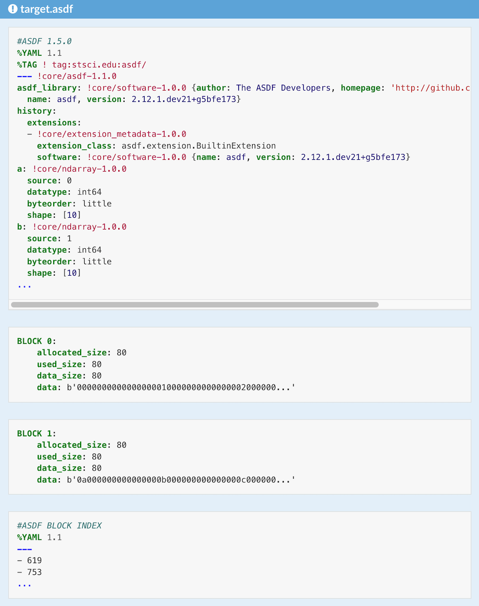

.. _tutorial1:

Working with ASDF Files in Python
=================================

This tutorial is based on a `workshop <https://github.com/asdf-format/scipy2022tutorial/>`__ presented by ASDF developers at the SciPy 2022 conference. By the end, you will know how to read and write ASDF files, how to use your own custom extensions, and be familiar with the overall file structure and schema. 

Each chapter includes a step-by-step guide and some brief exercises.

0. `ch0-installation`
1. `ch1-working`
2. `ch2-creating`
3. `ch3-anatomy`
4. `ch4-extensions`
5. `ch5-advanced`

.. _ch0-installation:

Installation
------------

**Requirements**

This tutorial requires the following to be installed on your system:

- git (optional)
- conda 4.6 or higher (optional)
- python 3.9 or higher
- Linux/Mac OS (for Windows, see note below)

.. note:: For Windows Users Only
    
    If you are using Windows, we now recommend using the Windows Subsystem for Linux (WSL) instead of using native Windows tools. WSL is now fully supported by Microsoft and tends to result in fewer install headaches, and lets you use tools that were developed for Linux seamlessly in windows. While you still may be able to use the Windows-native installation of Miniconda, these instructions focus on the WSL approach for the above reasons.
    
    To install WSL, you should follow the instructions provided by Microsoft:
    https://docs.microsoft.com/en-us/windows/wsl/install
    
    While you may choose an alternative Linux distribution from the default Ubuntu, the instructions below have been tested on Ubuntu, so unless you have a specific reason, we suggest you stick with the default. Once you reach the point in the instructions with a working Linux terminal prompt, you can proceed to step 1 of these instructions.
    
    Optional While you can run a WSL terminal with the command prompt built into Windows, it's rather bare-bones and you may not have the best experience. For WSL on Windows you'll probably want to install Windows Terminal to have a terminal experience closer to what you'd see on Mac or Linux.

1. Clone the workshop repository:

.. code:: bash

    git clone https://github.com/asdf-format/scipy2022tutorial.git

.. note::
    
    If not using git, you can download the ZIP file by opening the green Code button at `scipy2022tutorial <https://github.com/asdf-format/scipy2022tutorial/>`__ and selecting ``Download ZIP``.

2. Install dependencies

.. tabs::

    .. group-tab:: conda

        .. code:: bash

            cd scipy2022tutorial
            conda env create --file 00_install/environment.yml
            conda activate asdf-tutorial-env

    .. group-tab:: pip

        .. code:: bash

            # Create a virtual environment using your preferred tool such as venv
            python -m venv asdf-tutorial
            cd scipy2022tutorial
            touch requirements.txt
            cat << EOF >> requirements.txt
            jupyter
            notebook >= 6.0
            matplotlib >= 3.2
            numpy >= 1.16
            packaging
            pandas >= 1.0
            pyyaml
            asdf
            asdf-astropy
            asdf-standard
            astropy >= 4.2
            gwcs >= 0.16 
            EOF
            pip install -r requirements.txt

Check your installation by running the following script:

.. code:: bash
    
    python 00_install/verify_install.py

.. note::
    
    If the script reports that some versions do not match for a specific package (for example numpy), 
    you can update using conda or pip (whichever installer was used to install numpy):

.. tabs::

    .. group-tab:: conda

        .. code:: bash

            conda update numpy

    .. group-tab:: pip

        .. code:: bash

            pip install --upgrade numpy

4. Start the Jupyter Notebook

From inside the ``scipy2022tutorial`` directory with your virtual/conda environment active, run the notebook:

.. code:: bash

    jupyter notebook

.. note:: 
    
    If you see a red Kernel Error in the top right corner, click on it and scroll down to see the error message. If it says FileNotFoundError, shut down the notebook server on your terminal and run this command:

.. code:: bash

    python -m ipykernel install --user

Then run ``jupyter notebook`` again.

.. raw:: html

    

.. _ch1-working:

Working with ASDF Files
-----------------------

**OUTLINE**

1. Reading an ASDF File
2. Getting Information About a File (info and search)
3. Accessing and Modifying a file
4. Using a schema to validate a file
5. Adding History items
6. Command line utilities
7. Exercises

.. _t1-ch1-1:

1. Reading an ASDF File
^^^^^^^^^^^^^^^^^^^^^^^

The Python ASDF library is a standalone package distributed through PyPi and conda-forge.

.. code:: python

    import asdf

To open a file use the ``open`` function. It is useful to look up the keyword arguments it accepts, there are options specifying in what mode a file should be opened or whether it should be validated during opening. For this example we will use the default behavior and look at the object.

.. code:: python

    af = asdf.open("pluto.asdf")
    af

.. _t1-ch1-2:

2. Getting Info About a File
^^^^^^^^^^^^^^^^^^^^^^^^^^^^

There are two functions that allow introspecting a file: ``info`` and ``search``. They are available as methods on the ``AsdfFile`` object and the command line interface. Both are configurable through multiple parameters.

.. code:: python

    af.info()

The asdf library has search capabilities. A file can be searched for an attribute by name, type or value.

.. code:: python

    af.search("birthday")
    af.search(value="Pluto")

``astropy`` supports units and quantities. A ``Quantity`` is a value (scalar or array) with units attached to it. Let's searvh by type ``Quantity``.

.. code:: python

    from astropy import units as u
    af.search(type_=u.Quantity)

.. _t1-ch1-3:

3. Accessing/Modifying a File
^^^^^^^^^^^^^^^^^^^^^^^^^^^^^^^^^

Attributes are accessed using a dict-like interface. Note that what we get below is a ``Quantity`` object.

.. code:: python

    weight = af["mass"]
    print(weight)

.. _t1-ch1-4:

4. Using a Schema to Validate a File
^^^^^^^^^^^^^^^^^^^^^^^^^^^^^^^^^^^^

ASDF uses schemas to check that a file conforms to the :ref:`ASDF Standard <asdf-standard:asdf-standard>` and possibly the requirements of other extensions (see later notebooks). ``jsonschema`` is used for validation. Schema validation happens on reading (``asdf.open``) and writing (``write_to`` and ``update``).

However, sometimes it is useful for particular applications to impose additional restrictions when deciding whether a given file is valid or not. ASDF allows using "custom schemas" in such cases and passing them to the ``open`` function.

Let's see how to write a schema and make sure our file ``pluto.asdf`` is correct. A schema is just a text file and and any editor can be used to write it.

- There's a yaml header at the begining of each schema which states the version of the YAML schema, followed by ``---`` and the ``$schema`` declaration stating the draft.
- A schema file ends with ``...``
- The ASDF schemas use indentation, similar to YAML, and by convention it is 2 spaces.
- ``title`` is not required but by convention it's a one-line description of an attribute, printed as a comment by ``info()``.
- ``description`` is an optional, longer, possibly multi-line comment.
- ``type`` is required
- If a ``required`` field is present, all properties listed in it must be present in the file.

.. code:: python

    s = """
    %YAML 1.1
    ---
    $schema: http://stsci.edu/schemas/yaml-schema/draft-01

    title: Mickey's pet
    description: |
    Basic info and a picture of Mickie's 
    dog Pluto.

    type: object
    properties:
    age:
        title: The age of Pluto
        type: object
        properties:
        birthday:
            title: Pluto's first showing
            tag: tag:stsci.edu:asdf/time/time-1.1.0
    mass:
        title: How much he weighs.
        tag: tag:stsci.edu:asdf/unit/quantity-1.1.0
    picture:
        tag: tag:stsci.edu:asdf/core/ndarray-1.0.0
    name:
        title: Name
        type: string
    required: [name, picture]
    ...
    """

.. code:: python

    f = open("pluto-1.0.0.yaml", mode="w")
    f.write(s)
    f.close()

.. code:: python

    afs = asdf.open("pluto.asdf", custom_schema="./pluto-1.0.0.yaml")

.. _t1-ch1-5:

5. Adding History Items
^^^^^^^^^^^^^^^^^^^^^^^

When using ``asdf.info`` we see one of the properties is called ``History``. By default it stores a list of extensions used when processing the file. It is possible to add custom entries to this list.

.. code:: python

    afs.add_history_entry('First appeared in "The Chain Gang", 1930')

.. code:: python

    afs.info(max_rows=30)

.. code:: python

    afs.get_history_entries()

.. _t1-ch1-6:

6. Command Line Utilities
^^^^^^^^^^^^^^^^^^^^^^^^^

The library, asdf, includes a command-line tool, asdftool that performs a number of useful operations:

- **explode**: Convert a self-contained ASDF file into exploded form (see Saving external arrays).
- **implode**: Convert an ASDF file in exploded form into a self-contained file.
- **defragment**: Remove unused blocks and extra space.
- **diff**: Report differences between two ASDF files.
- **edit**: Edit the YAML portion of an ASDF file.
- **info**: Print a rendering of an ASDF tree.
- **extensions**: Show information about installed extensions (see Extensions from other packages).
- **tags**: List currently available tags.
- **to_yaml**: Inline all of the data in an ASDF file so that it is pure YAML.

Run ``asdftool --help`` for more information.

.. _t1-ch1-7:

7. Exercises
^^^^^^^^^^^^

**1. Reading and accessing data**

- Open the file ``jwst.asdf`` in the ``02_Working_With_ASDF_Files`` directory. Look at the ``info`` method's help and display the file using some of the arguments to show more contents.
- Search for a few attributes - ``wcs``, ``data`` (``wcs`` stands for World Coordinate System. In astronomy it represents the transform from pixel coordinates to sky coordinates or some physical system.)
- Retrieve the ``wcs`` object following the path showed by the search method
- Look at the ``wcs`` object and print ``wcs.forward_transform``
- Use matplotlib to display the data array
- Look at the ``data`` array and modify the value of ``data[0, 0]`` to 999.

**2. Explore schemas**

- Add ``additionalProperties=false`` to the schema and attempt to add a new property.
- Modify the schema to include a required property, called ``friend`` of type string.
- Open the file to see the error message

**3. Command line tool**

- Use ``asdftool`` in a terminal window to find the differences in the two files - ``pluto.asdf`` and ``pluto-friend.asdf``.
- Use some of the other options of ``asdftool``

.. raw:: html

    

.. _ch2-creating:

Creating ASDF Files
-------------------

**OUTLINE**

1. Creating ASDF Files Using Basic Python types
2. Creating ASDF Files with ``np.ndarray``
3. Serializing Other Objects

ASDF files store their information using a tree (nested key/value) structure. This allows the stored information be be hierarchically organized within the file. Without any extensions, this tree is a nested combination of basic data structures:

- maps,
- lists,
- arrays,
- strings,
- booleans,
- and numbers

All of which are stored using ``yaml``. Note that more complex structures (ones not directly supported by ``yaml``) are denoted using ``yaml`` tags. However, those tagged "sub-trees" are still comprised of the above basic structures and other tagged sub-trees. Additional tagged objects are supported via ASDF extensions.

The Python analogs for these types are:

    - maps ``-> dict``
    - lists ``-> list``
    - arrays ``-> np.ndarray``
    - strings ``-> str``
    - booleans ``-> bool``
    - and numbers ``-> int, float, complex`` (depending on the type of number)

Where ``np.ndarray`` are treated in a special way distinct from regular ``yaml`` (binary blocks). Note that due to limits imposed by Python, dictionary keys are limited to ``bool``, ``int``, or ``str`` types only, while value information can be any of the above data types.

Typically, when creating an ASDF file using the python library, one begins by creating a nested Python dictionary which corresponds to the nested tree structure one wants the file to have. Indeed, one can interact with any ``AsdfFile`` object as if it were a dictionary representing this tree structure

.. _t1-ch2-1:

1. Creating ASDF Files Using Basic Python Types
^^^^^^^^^^^^^^^^^^^^^^^^^^^^^^^^^^^^^^^^^^^^^^^

.. code:: python

    import asdf
    import numpy as np
    np.random.seed(42)

Let's first create an ASDF file with the key/value pair ``"hello": "world"``:

.. code:: python

    tree = {"hello": "world"}
    af = asdf.AsdfFile(tree)
    af.write_to("hello.asdf")
    af["hello"]

Open the ``hello.asdf`` file in your favorite text editor. You should see a something that looks like:

.. code:: python

    with open("hello.asdf") as f:
        print(f.read())

Notice that the file contains more information than just the ``"hello": "world"`` key value that we entered. It contains information on the library used to create the file under ``asdf_library``, and information on what the ASDF library needs (schemas, extensions, etc.) to deserialize the stored data under ``history``.

Exercise 2.1
""""""""""""

Create an ASDF file that stores information using all the basic Python types except ``np.ndarray``

.. _t1-ch2-2:

2. Creating ASDF Files with ``np.ndarray``
^^^^^^^^^^^^^^^^^^^^^^^^^^^^^^^^^^^^^^^^^^

Beyond the maps, lists, strings, and numbers built into Python, ASDF can save arrays, in particular numpy arrays (``np.array``). Indeed, much of ASDF is dedicated to efficiently saving arrays.

For example if suppose we want to save a random 8x8 numpy array:

.. code:: python

    tree = {"random_array": np.random.rand(8, 8)}
    af = asdf.AsdfFile(tree)
    af.write_to("random.asdf")

Now opening this file in your text editor will result in something like:

.. code:: python

    with open("random.asdf", "r", encoding="unicode_escape") as f:
        print(f.read())

Observe that at the end of the file there is apparently some binary data. This binary data contains the information in the random array we wrote. Indeed, when ASDF writes arrays to the file it stores them as binary data in a block after the YAML section of the file rather in the section itself. Note that ``random_array`` in the YAML section stores some information about the nature of the array and includes the ``source`` key. This ``source`` value references which binary block (in this case block ``0``) the data is stored in.

Note that ASDF will store this data in an efficient manner. By this we mean that arrays shared between different objects stored in the ASDF tree, will only be stored once as a binary block with both entries in the yaml metadata will both reference the same binary block. Moreover, this extends to objects which reference a different view of the same data, meaning the views will all still reference the same binary block, only storing information on the view itself.

Exercise 2.2
""""""""""""

Create tree containing the same ``np.ndarray`` twice, and multiple views on the same ``np.ndarray``.

.. _t1-ch2-3:

3. Serializing Other Objects
^^^^^^^^^^^^^^^^^^^^^^^^^^^^

As mentioned above, other types of objects can also be serialized by ASDF including objects outside the ASDF-standard; However, support for these objects requires the creation of an ASDF extension, which we will describe in a later tutorial.

For our current purposes recall that these objects are denoted in the ``yaml`` metadata via a ``yaml`` tag. Indeed some of the objects already discussed are tagged in the metadata. These tags are used by ASDF to determine which extension to use when reading an ASDF file. This enables the "seamless" nature of reading objects from an ASDF file, provided the necessary ASDF extension is installed. Note that when a tagged object is present in an ASDF file, but no extension can be found to handle that tag ASDF will raise a warning and return that "object" in its "raw" form, meaning you will get the nested dictionary object rather than a fully realized instance of the object you wrote.

On the other hand, ASDF extensions specify what Python objects they support. This is how ASDF can seamlessly recognize a complex object and serialize it with no input from the user (other than installing the correct ASDF extensions).

For example, as part of the install for this course we installed the ``asdf-astropy`` package, which provides extensions for writing many astropy objects. Indeed ``asdf-astropy`` enables ASDF support for:

- ``astropy`` ``unit`` and ``quantity`` objects.
- (Most) ``astropy`` model objects.
- ``astropy`` ``Time`` objects.
- ``astropy`` coordinate and frame objects.
- ``astropy`` ``Table`` objects.

Thus serializing an ``astropy`` ``Table`` object:

.. code:: python

    from astropy.table import Table
    tree = {"table": Table(dtype=[("a", "f4"), ("b", "i4"), ("c", "S2")])}
    af = asdf.AsdfFile(tree)
    af.write_to("table.asdf")

Notice how no additional effort was needed to write the ASDF file since ``asdf-astropy`` was installed already. Now let's perform a cursory inspection of the ``table.asdf`` file:

.. code:: python

    with open("table.asdf", "r", encoding="unicode_escape") as f:
        print(f.read())

Exercise 2.3
""""""""""""

Write an ASDF file containing the following astropy objects:

1. ``Quantity``

2. A ``model``

*Hint* : The ``astropy.modeling`` package provides a framework for representing models and performing model evaluation and fitting. Models are initialized using their parameters

.. code:: python

    from astropy.modeling import models
    gauss = models.Gaussian1D(amplitude=10, mean=3, stddev=1.2)

3. A ``Time`` object

*Hint*: The ``astropy.time`` package provides functionality for manipulating times and dates. To initialize it supply a string and a format, or supply a datetime object.

4. A Celestial coordinate object (astronomy specific).

.. raw:: html

    

.. _ch3-anatomy:

Anatomy of ASDF Internals
-------------------------

*And How the Python Library Works with Them*

.. _t1-ch3-1:

1. High Level Structure
^^^^^^^^^^^^^^^^^^^^^^^

The high level structure of an ASDF file is fairly simple. It starts with a few lines indicating that it is an ASDF file, what version of ASDF created it and the version of YAML that was used. This is followed by a header in YAML format, which is intended to define all metadata and references to all binary data. Binary data, if there is any, follows the YAML in binary blocks. Generally speaking, simple arrays and tables each use a binary block (views into such arrays and tables are supported). Currently there is a block index at the end of the file to enable quicker access to individual blocks.

The following schematically illustrates this structure where there are two arrays stored in two binary blocks.

When the asdf library opens a file such as this, the arrays are not loaded until the attribute is "accessed". For example:

.. code:: python

    import asdf
    import numpy as np

    a = np.arange(10)
    b = np.zeros((5, 5))
    af = asdf.AsdfFile({"a": a, "b": b})
    af.write_to("demo.asdf")
    af2 = asdf.open("demo.asdf")
    tree = af2.tree  # no arrays have been loaded
    aa = tree["a"]  # Array still isn't loaded
    print(aa)
    aa[2]  # This loads the array
    print(aa)

.. _t1-ch3-2:

2. Memory Mapping
^^^^^^^^^^^^^^^^^

By default binary blocks use memory mapping. This obviously has advantages, but it also has disadvantages, particularly if dangling references to arrays are kept after the ASDF file is closed. It is possible to disable memory mapping by opening the file as follows:

.. code:: python

    af_no_memmap = asdf.open("demo.asdf", copy_arrays=True)
    # Likewise supported in contructor, e.g:
    af3 = asdf.AsdfFile(copy_arrays=True)

.. _t1-ch3-3:

3. Primitive Content
^^^^^^^^^^^^^^^^^^^^

Untagged elements get turned into Python dicts, lists, and basic data types (strings, floats, ints, and booleans) corresponding the YAML structure.

.. code:: python

    tree = {
        "a": 6.0,
        "b": True,
        "c": 11,
        "d": "goodbye world",
        "e": [1, 4, 9, 16],
        "f": {"x": [1, 3, 5], "y": {"nests": True, "top": False}},
    }
    af = asdf.AsdfFile(tree)
    af.write_to("primitive.asdf")
    text = open("primitive.asdf").read()
    print(text)

.. code:: python

    af2 = asdf.open("primitive.asdf")
    tree = af2.tree
    tree

.. _t1-ch3-4:

4. Tags
^^^^^^^

- The use of YAML tag syntax is used as a mechanism by the Python library to do something special with the content that follows.
- The ``asdf`` library has machinery that links tags to code that knows how to turn the content into a Python object, as well as find an associated schema to validate that content in the ASDF file (examples covered in the next segment).
- You have already seen one example of a tag, that is, for array data. Anyone can define their own tags and write their own converters for turning tags into Python objects.
- In serializing these objects to ASDF, the converters also register Python types that they handle, and the tags that are associated with the type. When that type is serialized, it will be labeled with a tag so that when reading it back in, it will generate an identical object (but not the same object!).
- If the needed extension isn't installed, ASDF will issue a warning, and load the corresponding YAML content as primitives.

We will use an example that uses tags defined in the astropy library that handle quantities. Quantities are floats (scalars or arrays) that have associated units.

.. code:: python

    import astropy.units as u
    import numpy as np

    q1 = 1609.34 * u.m
    q2 = np.arange(10) * (u.imperial.mile / u.hour)
    print(q1)
    print(q2)

.. code:: python

    tree = {"distance": q1, "speed": q2}
    af.tree = tree
    af.write_to("tagdemo.asdf", all_array_storage="inline")
    text = open("tagdemo.asdf").read()
    print(text)

.. code:: python

    af2 = asdf.open("tagdemo.asdf")
    tree2 = af2.tree
    print(type(tree2["distance"]))
    print(tree2["distance"])
    print(type(tree2["speed"]))
    print(tree2["speed"])

.. code:: python

    tree2["distance"] * (1 / (3600 * u.s))

.. _t1-ch3-5:

5. Avoiding Copies in ASDF Files
^^^^^^^^^^^^^^^^^^^^^^^^^^^^^^^^

In hierarchical structures, it may be necesary for different components to refer to the same object. Ideally one does not want to have multiple copies in such a case. YAML provides a mechanism to avoid that. The Python library recognizes when this is the case and serializes the information only one time. The following illustrates this in a case where two data arrays share the same masking array.

.. code:: python

    import numpy.random as nr

    rng = nr.default_rng()
    mask = rng.integers(2, size=10)
    data1 = rng.random(size=10)
    data2 = rng.random(size=10)
    af.tree = {
        "dataset1": {"data": data1, "mask": mask},
        "dataset2": {"data": data2, "mask": mask},
    }
    af.write_to("refdemo.asdf", all_array_storage="inline")
    text = open("refdemo.asdf").read()
    print(text)

.. code:: python

    af2 = asdf.open("refdemo.asdf")
    t = af2.tree
    print(id(t["dataset1"]["mask"]))
    print(id(t["dataset2"]["mask"]))
    print(t["dataset1"]["mask"])

.. _t1-ch3-6:

6. Exercises
^^^^^^^^^^^^

1. To illustrate that ASDF files without binary data can be edited by hand, modify a copy of the ``tagdemo.asdf`` file with a text editor to double the size of the speed array, and and add another scalar quantity (your choice of attribute name and units; for documentation on astropy units available see: https://docs.astropy.org/en/stable/units/index.html#module-astropy.units.si). Note that you will need to include the appropriate tags for the new quantity using the other instances as a template.

2. Open with asdf the file ``exercise2.asdf`` and use ``info()`` to find shared items, and all special objects in the file (e.g., anything that is not a dict, list, or primitive value). List these along with their types. (Hint: shared items in the ``info()`` output show up as "recursive reference".

3. Define a common multi-line description for all the dicts that have "widget" in their attribute name as a list of strings (reason given in solution) and add it as the "description" attribute for that dict. Save the file and confirm by editor, less, or any other tool to view the contents that this description only appears once in the YAML, and is referred to in all other references to it.

.. raw:: html

    

.. _ch4-extensions:

Creating Custom ASDF Extensions
-------------------------------

Often we want to be able to save our "custom" python objects to ASDF in a "seamless" fashion. Earlier we were able to save various astropy objects using ``asdf-astropy`` in chapter 3 `ch3-anatomy` above. Here we will discuss how to create the necessary ASDF extension(s) to support doing this for a "custom" object so that ASDF can read (deserialize) and write (serialize) that object. Note that for a given object, we typically expect an ASDF extension supporting that object to "round-trip" that object, meaning the object can be serialized to ASDF and then deserialized from ASDF to an object which is an exact functional copy of the original object.

.. code:: python

    import asdf
    import os
    import numpy as np
    from dataclasses import dataclass
    from pathlib import Path

.. _t1-ch4-1:

1. Create Example Object
^^^^^^^^^^^^^^^^^^^^^^^^

Let's create a relatively simple Python object, which we would like to handle seamlessly with ASDF. For our purposes lets consider a geometric ellipse described by its

- semi-major axis
- semi-minor axis

.. code:: python

    @dataclass
    class Ellipse:
        """An ellipse defined by semi-major and semi-minor axes.

        Note: Using a dataclass to define the object so that we get `==` for free.
        """
        semi_major: float
        semi_minor: float

Note that ASDF will handle objects contained inside the objects you wish to serialize provided that those objects are handled intrinsically by ASDF or an extension which handles each particular object is available for ASDF to use. For example, if we wanted to specify the axes of the ellipse using astropy ``Quantity`` objects (to attach units), so long as ``asdf-astropy`` is installed, ASDF would handle this transparently.

.. _t1-ch4-2:

2. Introduction to Writing an Extension
^^^^^^^^^^^^^^^^^^^^^^^^^^^^^^^^^^^^^^^

An ASDF extension requires two components to function properly:

1. A ``tag`` for the object, so that ASDF identify/validate the object to deserialize it from an ASDF file.
2. A ``Converter`` for the object, so ASDF knows how to serialize and deserialize the object to and from an ASDF file.

The ``tag`` is defined through the schemas and related resources for ASDF to use. While the ``Converter`` is a python object which provides the code the ASDF library executes in order to handle the serialization or deserialization process. The ``Converter`` is then wrapped inside an ASDF ``Extension`` object (which can contain several different ``Converter`` s), which is then added to ASDF (typically) via an entry point.

.. _t1-ch4-3:

3. Creating a ``tag``
^^^^^^^^^^^^^^^^^^^^^

Recall that ASDF supports the use of schemas for validating the correctness of the information stored within its files. Often one wishes to create a schema for a specific object so that the particular object the schema description can be reused in other schemas. A ``tag`` is a reference to a specific schema or set of schemas that a particular value in an ASDF file tree need to satisfy. This ``tag`` is then used within the ``yaml`` metadata to identify the sub-tree which represents the object within the ASDF file. Thus the tag serves two purposes:

1. Identifying the schema used to validate a sub-tree of the ASDF tree.
2. Identifying the object a particular sub-tree describes.

This means that in order to create a ``tag`` for a given Python object we really need to create resource ``yaml`` files for ASDF to do two things:

1. Contain schema(s) used by that ``tag``.
2. Create an association between the schema(s) and the ``tag``.

.. _t1-ch4-4:

4. Creating a Schema
^^^^^^^^^^^^^^^^^^^^

Recall that in chapter 3 `ch3-anatomy` above, we discussed in depth how to create ASDF schemas. In particular note that schemas are typically stored in ``yaml`` files which are then loaded into ASDF via an entry point.

To begin with lets create the schema for ``Ellipse`` dynamically (without needing to package our code for an entry point):

.. code:: python

    ellipse_uri = "asdf://example.com/example-project/schemas/ellipse-1.0.0"

    ellipse_schema_content = f"""
    %YAML 1.1
    ---
    $schema: http://stsci.edu/schemas/yaml-schema/draft-01
    id: {ellipse_uri}

    type: object
    properties:
    semi_major:
        type: number
    semi_minor:
        type: number
    required: [semi_major, semi_minor]
    ...
    """

This can then be dynamically added to ASDF using the ``add_resource_mapping``. This adds a map (``dict``) between a ``uri`` (universal resource identifier) string and the content of the resource to ASDF. Later, when working with the entry points directly, we will need to specify how to build these mappings.

Note we highly recommend as best practice to always have the ``id`` for any resource and the ``uri`` string be the same. This is to limit the possibility of confusing how to look-up the given schema as JSON schema (the base language/library used for ASDF schemas) uses the ``id`` field to reference resources among one-another, while ASDF uses the ``uri`` as keys to find those resources on disk. One does not have to follow this practice, but it is highly discouraged.

.. code:: python

    asdf.get_config().add_resource_mapping({ellipse_uri: ellipse_schema_content})

Let's now load and check that the schema we just created is a valid schema:

.. code:: python

    schema = asdf.schema.load_schema(ellipse_uri)
    asdf.schema.check_schema(schema)

Note that ``asdf.schema.check_schema`` will work directly on any ``yaml`` file loaded through the ``pyyaml`` interface. Lets also attempt to validate a portion of an ASDF tree for ``Ellipse`` against this schema:

.. code:: python

    # Valid tree

    test_ellipse_object = {"semi_major": 1.0, "semi_minor": 2.0}
    asdf.schema.validate(test_ellipse_object, schema=schema)

.. code:: python

    # Invalid tree

    test_ellipse_object = {"semi_major": 3.0}
    asdf.schema.validate(test_ellipse_object, schema=schema)

Note that ASDF provides a ``pytest`` plugin which can be configured to automatically generate unit tests which will check and validate all of the schemas in your package. In fact, you can include "examples" of the tree the schema is checking and the plugin will test that those examples do correctly validate against the schema itself.

Exercise 1
""""""""""

Create, add, and check a schema for the ``Rectangle`` object below:

.. code:: python

    @dataclass
    class Rectangle:
        base: float
        height: float

.. _t1-ch4-5:

5. Creating the ``tag`` Itself
^^^^^^^^^^^^^^^^^^^^^^^^^^^^^^

ASDF uses a special ``schema`` to specify the ``tag`` s for a given ASDF extension. This special type of ``schema`` is called a manifest which lists each ``tag`` as a pair of ``uri`` s:

- ``tag_uri`` , the ``uri`` which will be used for the tag.
- ``schema_uri`` , the ASDF ``uri`` used to reference the specific ``schema`` (s) involved.

This allows for a given ``schema`` to be reused for multiple ``tag`` s. Such as for objects which contain the same serializable data, but have different Python functionalities which need to be distinguished.

The following is an example for creating/adding a manifest for an extension which has the resources for the ``Ellipse`` object:

.. code:: python

    shapes_manifest_uri = "asdf://example.com/example-project/manifests/shapes-1.0.0"
    shapes_extension_uri = "asdf://example.com/example-project/extensions/shapes-1.0.0"
    ellipse_tag = "asdf://example.com/example-project/tags/ellipse-1.0.0"

    shapes_manifest_content = f"""
    %YAML 1.1
    ---
    id: {shapes_manifest_uri}
    extension_uri: {shapes_extension_uri}

    title: Example Shape extension 1.0.0
    description: Tags for example shape objects.

    tags:
    - tag_uri: {ellipse_tag}
        schema_uri: {ellipse_uri}
    ...
    """

    asdf.get_config().add_resource_mapping({shapes_manifest_uri: shapes_manifest_content})

We again add this ``manifest`` to ASDF via the ``add_resource_mapping`` interface. Note that the ``extension_uri`` field defines the uri that the whole ``Extension`` (resource(s) combined with Converter(s)) uses within ASDF. The ``extension_uri`` will be referenced later by the ``Extension`` object so that the extension code will be available when the correct resources are available and vice-versa.

Since the ``manifest`` is just like any other schema we can check it in the same way:

.. code:: python

    # check
    schema = asdf.schema.load_schema(shapes_manifest_uri)
    asdf.schema.check_schema(schema)
    asdf.schema.validate(shapes_manifest_content, schema=schema)

Exercise 2
""""""""""

Add a ``tag`` for your ``rectangle`` schema to the ``shapes-1.0.0`` manifest and add your manifest to ASDF.

.. _t1-ch4-6:

6. Create a ``Converter``
^^^^^^^^^^^^^^^^^^^^^^^^^

All converters should be constructed as subclasses of the abstract type ``asdf.extension.Converter``, which requires that you define two methods:

1. ``to_yaml_tree``: which converts a Python object into an ASDF tree.
2. ``from_yaml_tree``: which converts an ASDF tree into a python object.

Note that these methods can account for the type/tag of the objects attempting to be converted. 

Moreover your converter also needs to define the following two variables:

1. ``tags``: A list of tags that this converter will use when reading ASDF.
2. ``types``: A list of Python (object) types that this converter will use when writing ASDF.

Note that these lists do not need to be indexed with respect to each other, and that in order for the converter to actually be used by ASDF, at least one of the ``tags`` needs to be registered as a resource with ASDF (usually via the entry point).

An example converter for ``Ellipse``:

.. code:: python

    class EllipseConverter(asdf.extension.Converter):
        tags = [ellipse_tag]
        types = [Ellipse]

        def to_yaml_tree(self, obj, tag, ctx):
            return {
                "semi_major": obj.semi_major,
                "semi_minor": obj.semi_minor,
            }

        def from_yaml_tree(self, node, tag, ctx):
            return Ellipse(semi_major=node["semi_major"], semi_minor=node["semi_minor"])

Recall that the converter itself will be added to ASDF via an ``Extension`` not as a resource like the ``schema`` s above. Note that, for performance of the entry points, one will normally defer the ``import`` of the object (``Ellipse`` in this case) until ``from_yaml_tree`` is actually called.

Exercise 3
""""""""""

Create a converter for the ``Rectangle`` object.

 
.. _t1-ch4-7:

7. Create the Full Extension
^^^^^^^^^^^^^^^^^^^^^^^^^^^^

Now let's dynamically create an extension for ASDF to support the ``Ellipse`` object using the ``EllipseConverter`` we just created and the ``ellipse_tag`` we created earlier.

This can be accomplished via using the ``asdf.extensions.ManifestExtension.from_uri`` constructor, which in our case requires two arguments:

1. The ``manifest_uri``, the ``uri`` the manifest was added under.
2. The ``converters``, a list of instances of ``Converter`` classes.

Note that one can also pass a list of ``Compressor`` objects (ASDF objects to handle custom binary block compression).

An instance of the extension object can then be dynamically added to ASDF using the ``add_extension`` method.

.. code:: python

    shapes_extension = asdf.extension.ManifestExtension.from_uri(
        shapes_manifest_uri, converters=[EllipseConverter()]
    )
    asdf.get_config().add_extension(shapes_extension)

Alternately one can create an ``Extension`` object directly by ``extending asdf.extension.Extension`` and specifying the variables:

1. ``extension_uri``, the ``extension_uri`` specified within the ``manifest`` in question.
2. ``converters``, the list of ``Converter`` objects making up the extension.
3. ``tags``, the list of tags those ``Converter`` objects use from the ``manifest`` referenced.

which can then be dynamically added in exactly the same way.

Note that the ``from_uri`` constructor, figures out all this information from the ``uri`` and ``Converter`` objects themselves.

.. code:: python

    class EllipseExtension(asdf.extension.Extension):
        extension_uri = shapes_extension_uri
        converters = [EllipseConverter()]
        tags = [ellipse_tag]

    asdf.get_config().add_extension(EllipseExtension())

.. _t1-ch4-8:

8. Testing the ``Ellipse`` Extension
^^^^^^^^^^^^^^^^^^^^^^^^^^^^^^^^^^^^^^

Let's now check that we can round-trip an ``Ellipse`` object through ASDF:

.. code:: python

    ellipse = Ellipse(1.0, 2.0)

    with asdf.AsdfFile() as af:
        af["ellipse"] = ellipse
        af.write_to("ellipse.asdf")

Let's examine the contents of the ASDF file and then read/compare them to our original object:

.. code:: python

    with open("ellipse.asdf") as f:
        print(f.read())

    with asdf.open("ellipse.asdf") as af:
        print(af["ellipse"])
        assert af["ellipse"] == ellipse

Exercise 4
""""""""""

Create, add, and test an extension for your ``RectangleConverter``.

.. _t1-ch4-9:

9. Using Entry-Points to Automatically Extend ASDF
^^^^^^^^^^^^^^^^^^^^^^^^^^^^^^^^^^^^^^^^^^^^^^^^^^

Obviously, having to dynamically add all the resources and extensions to ASDF every time you want to work with a custom object is tedious. Indeed, ``asdf-astropy`` only needs to be installed so that its ``Extensions`` are available for ASDF to use. This is accomplished by using Python entry-points (mechanism for one python package to communicate information to another Python package), to enable automatic discovery and loading of resources and extensions for ASDF.

Since entry-points are a means for Python packages to communicate with one-another, their use requires you to package your Python code, which is can be a complex issue. Thus we will assume that you have an existing Python package, that you wish to add our example ASDF extension to.

To create our entry-points we will need to make three modifications to the packaging components of the existing Python package:

1. Create an entry point to add the **resources** to ASDF.
2. Create an entry point to add the **extensions** to ASDF.

Note that we will assume that you are using the ``setup.cfg`` file to configure your python package. This can also be done via the ``pyproject.toml`` file in a similar fashion (see ASDF docs for details).

.. _t1-ch4-10:

10. Create an Entry-Point for the Resources
^^^^^^^^^^^^^^^^^^^^^^^^^^^^^^^^^^^^^^^^^^^

ASDF treats the information it receives from the entry-points it checks for resources as a function that it can evaluate to get a list of resource mappings. To begin suppose that there your package is called ``asdf_shapes`` and the function you need to call in order to get this list of mappings is called ``get_resource_mappings`` and is located in the ``integration`` module, that is you need to import ``get_resource_mappings`` from ``asdf_shapes.integration``. Given this setup you will need to add the following to your ``setup.cfg``:

.. code:: bash

    [options.entry_points]
    asdf.resource_mappings =
        asdf_shapes_schemas = asdf_shapes.integration:get_resource_mappings

Breaking this down:

- The entry-point ASDF checks for resources is ``asdf.resource_mappings``.
- The identifier for your package's resources in this case is ``asdf_shapes_schemas``.
- The method to that needs to be executed is ``asdf_shapes.integration:get_resource_mappings`` which corresponds to the form ``module:function``.

Now let's talk about how to create the ``get_resource_mappings`` function. First, lets go ahead a create the ``yaml`` files for the resources we used in our example in order to illustrate an example organization of these resource files:

.. code:: python

    schema_root = "resources/schemas"
    manifest_root = "resources/manifests"

    os.makedirs(schema_root, exist_ok=True)
    os.makedirs(manifest_root, exist_ok=True)

    with open(f"{schema_root}/ellipse-1.0.0.yaml", "w") as f:
        f.write(ellipse_schema_content)

    with open(f"{manifest_root}/shapes-1.0.0.yaml", "w") as f:
        f.write(shapes_manifest_content)

Normally we organize the resource files into a directory structure (as we just did) which can be parsed to form part of the URI (``id``) used for each resource document as part of the file path. This is done so that adding resources can be performed by ASDF by crawling these directory structures where the directory structure helps to determine the ``uri``.

ASDF provides the ``asdf.resource.DirectoryResourceMapping`` object to crawl resource directories. It allows us to turn these directory structures into resource mappings, which can subsequently be added to ASDF using the entry-points.

These objects require two input parameters:

1. A path to the root directory which contains the resources to be added.
2. The prefix that will be used together with the file names to generate the uri for the resource in question.

There are some optional inputs:

1. ``recursive``: (default ``False``) which determines if the object will search recursively through subdirectories.
2. ``filename_pattern`` : (default: ``*.yaml``) Glob pattern for the files that should be added.
3. ``stem_filename``: (default: ``True``) determine if the file extension should be removed when creating the ``uri``.

In this case we do not need to set any of the file, here we need to do only the following:

.. code:: python

    # In module asdf_shapes.integration
    def get_resource_mappings():
        schema_prefix = "asdf://example.com/example-project/schemas/"
        manifest_prefix = "asdf://example.com/example-project/manifests/"
        return [
            asdf.resource.DirectoryResourceMapping(schema_root, schema_prefix),
            asdf.resource.DirectoryResourceMapping(manifest_root, manifest_prefix),
        ]

Which can then be referenced by the entry-point. Note that for performance reasons, we suggest you limit the top-level imports of the file(s) you load your entry points from to as few as possible, going as far as deferring imports to inside the entry-point functions when possible. This is because asdf will import all of these models immediately when ``asdf.open`` is called meaning large imports will cause noticeable delays especially when using the command-line interface.

.. _t1-ch4-11:

11. Create an Entry-Point for the Extensions
^^^^^^^^^^^^^^^^^^^^^^^^^^^^^^^^^^^^^^^^^^^^

In a similar fashion to resources, ASDF assumes the entry-points it checks for extensions as functions which return lists of ``asdf.extension.Extension`` objects. Thus lets assume your function is called ``get_extensions`` and is in the ``asdf_shapes.integration`` module alongside ``get_resource_mappings``. Adding the entry-point to ``setup.cfg`` for this would look something like:

.. code:: bash

    [options.entry_points]
    asdf.extensions =
        asdf_shapes_extensions = asdf_shapes.integration:get_extensions

Breaking this down:

- The entry-point that ASDF checks for ``Extension`` s is ``asdf.extensions``.
- The identifier for your package's extensions in this case is ``asdf_shapes_extensions``.
- The method to that needs to be executed is ``asdf_shapes.integration:get_extensions`` which corresponds to the form ``module:function``.

The structure of ``get_extensions`` will be similar to that for ``get_resource_mappings``:

.. code:: python

    # In module asdf_shapes.integration
    def get_extensions():
        # import EllipseConverter inside this function
        return [
            asdf.extension.ManifestExtension.from_uri(
                shapes_manifest_uri, converters=[EllipseConverter()]
            )
        ]

Once your package is installed with these changes, ASDF will automatically detect and use your ASDF extension as needed in a seamless fashion.

.. _t1-ch4-12:

12. Extending Our Example Object
^^^^^^^^^^^^^^^^^^^^^^^^^^^^^^^^

Suppose that we want to extend our object so that it represents an ``Ellipse`` rotated around the origin off the XY plane, that is add a position angle:

.. code:: python

    @dataclass
    class RotatedEllipse(Ellipse):
        position_angle: float

**Extend the Schema**

JSON schema does not support the concept of inheritance, which makes "extending" an existing schema somewhat awkward. What we do instead is create a schema which adds attributes to the existing schema via the ``allOf`` operation. In this case, we can define the a schema for ``RotatedEllipse`` by adding a ``position_angle`` property:

.. code:: python

    rotated_ellipse_uri = "asdf://example.com/example-project/schemas/rotated_ellipse-1.0.0"

    rotated_ellipse_schema_content = f"""
    %YAML 1.1
    ---
    $schema: http://stsci.edu/schemas/yaml-schema/draft-01
    id: {rotated_ellipse_uri}

    allOf:
    - $ref: {ellipse_uri}
    - properties:
        position_angle:
            type: number
        required: [position_angle]
    ...
    """

    asdf.get_config().add_resource_mapping(
        {rotated_ellipse_uri: rotated_ellipse_schema_content}
    )

    # check
    schema = asdf.schema.load_schema(rotated_ellipse_uri)
    asdf.schema.check_schema(schema)

    test_rotated_ellipse_object = {
        "semi_major": 1.0,
        "semi_minor": 2.0,
        "position_angle": 3.0,
    }
    asdf.schema.validate(test_rotated_ellipse_object, schema=schema)

Exercise 5
""""""""""

Create a schema for the ``RectanglularPrism`` object below using the one for ``Rectangle``:

.. code:: python

    @dataclass
    class RectangularPrism(Rectangle):
        depth: float

.. _t1-ch4-13:

13. Create an Updated Manifest
^^^^^^^^^^^^^^^^^^^^^^^^^^^^^^

Now let's extend the ``shapes-1.0.0`` manifest to include a ``rotated_ellipse-1.0.0`` tag. Note that if a manifest is already released and in use, it is recommended that one create a new manifest whenever schemas or tags need to be modified.

.. code:: python

    rotated_ellipse_tag = "asdf://example.com/example-project/tags/rotated_ellipse-1.0.0"

    shapes_manifest_content = f"""
    %YAML 1.1
    ---
    id: {shapes_manifest_uri}
    extension_uri: {shapes_extension_uri}

    title: Example Shape extension 1.0.0
    description: Tags for example shape objects.

    tags:
    - tag_uri: {ellipse_tag}
        schema_uri: {ellipse_uri}

    - tag_uri: {rotated_ellipse_tag}
        schema_uri: {rotated_ellipse_uri}
    ...
    """

    asdf.get_config().add_resource_mapping({shapes_manifest_uri: shapes_manifest_content})

    # check
    schema = asdf.schema.load_schema(shapes_manifest_uri)
    asdf.schema.check_schema(schema)
    asdf.schema.validate(shapes_manifest_content, schema=schema)

Exercise 6
""""""""""

Update the manifest with a tag for ``RectangularPrism``.

.. _t1-ch4-14:

14. Create an Updated Converter
^^^^^^^^^^^^^^^^^^^^^^^^^^^^^^^

The "simplest" approach to creating a ``Converter`` for ``RotatedEllipse`` would be to simply create a new converter as we did above for ``Ellipse``; however, we can also take advantage of the fact that multiple ``tags`` and ``types`` can be listed. Note that when multiple tags are handled by the same ``Converter``, we need to also implement a ``select_tag`` method:

.. code:: python

    class RotatedEllipseConverter(asdf.extension.Converter):
        tags = [ellipse_tag, rotated_ellipse_tag]
        types = [Ellipse, RotatedEllipse]

        def select_tag(self, obj, tag, ctx):
            if isinstance(obj, RotatedEllipse):
                return rotated_ellipse_tag
            elif isinstance(obj, Ellipse):
                return ellipse_tag
            else:
                raise ValueError(f"Unknown object {type(obj)}")

        def to_yaml_tree(self, obj, tag, ctx):
            tree = {
                "semi_major": obj.semi_major,
                "semi_minor": obj.semi_minor,
            }

            if tag == rotated_ellipse_tag:
                tree["position_angle"] = obj.position_angle

            return tree

        def from_yaml_tree(self, node, tag, ctx):
            if tag == ellipse_tag:
                return Ellipse(**node)
            elif tag == rotated_ellipse_tag:
                return RotatedEllipse(**node)
            else:
                raise ValueError(f"Unknown tag {tag}")

Exercise 7
""""""""""

Create a converter to support ``Rectangle`` and ``RectagularPrism``.

.. _t1-ch4-15:

15. Creating an Updated Extension
^^^^^^^^^^^^^^^^^^^^^^^^^^^^^^^^^

We can now use this converter to create a new "updated" extension:

.. code:: python

    shapes_extension = asdf.extension.ManifestExtension.from_uri(
        shapes_manifest_uri, converters=[RotatedEllipseConverter()]
    )
    asdf.get_config().add_extension(shapes_extension)

.. _t1-ch4-16:

16. Checking the New Extension
^^^^^^^^^^^^^^^^^^^^^^^^^^^^^^

Let's check this new extension by writing both an ``Ellipse`` and ``Ellipse3D`` object to ASDF:

.. code:: python

    ellipse = Ellipse(1.0, 2.0)
    rotated_ellipse = RotatedEllipse(1.0, 2.0, 3.0)

    with asdf.AsdfFile() as af:
        af["ellipse"] = ellipse
        af["rotated_ellipse"] = rotated_ellipse
        af.write_to("rotated_ellipse.asdf")

    # Check
    with open("rotated_ellipse.asdf") as f:
        print(f.read())

    with asdf.open("rotated_ellipse.asdf") as af:
        print(af["ellipse"])
        assert af["ellipse"] == ellipse

        print(af["rotated_ellipse"])
        assert af["rotated_ellipse"] == rotated_ellipse

Exercise 8
""""""""""

Create and check an extension supporting Ellipse, RotatedEllipse, Rectangle, and RectangularPrism.

.. raw:: html

    

.. _ch5-advanced:

Advanced Topics and Plans
-------------------------

Capabilities not yet covered:

- Serializing analytic models without pickle
- When arrays are loaded
- Memory mapping
- Handling in-line vs binary array choices
    - E.g., files editable with a text editor
    - Easily printed out
    - Enables scientists to use own code to read contents without ASDF libraries
- Handling compression of arrays

.. _t1-ch5-1:

1. Serializing Models
^^^^^^^^^^^^^^^^^^^^^

Uses ``astropy`` models:

.. code:: python

    import os
    import astropy.modeling.models as amm
    import numpy as np
    import asdf
    from matplotlib import pyplot as plt

    # Create a simple model

    poly_model = amm.Polynomial1D(degree=3, c0=1.0, c3=1.0)
    poly_model.coeff = (1.0, 0.0, 0.0, 1.0)
    x = np.linspace(-5, 5, 101)
    plt.plot(x, poly_model(x))

.. code:: python

    af = asdf.AsdfFile()
    af.tree = {"model": poly_model}
    af.write_to("model.asdf")
    af2 = asdf.open("model.asdf")
    poly_model2 = af2.tree["model"]
    print(poly_model2(x) - poly_model(x))

.. code:: python

    # Compound model example
    compound = (
        poly_model + amm.Sine1D(amplitude=20.0, frequency=1.0, phase=0.0)
    ) | amm.Gaussian1D(amplitude=10.0, mean=0.0, stddev=10.0)
    plt.plot(x, compound(x))

.. code:: python

    af.tree = {"compound": compound}
    af.write_to("compound.asdf", all_array_storage="inline")
    with open("compound.asdf", "rb") as asdftext:
        text = asdftext.read()
        print(text.decode("utf-8"))

.. _t1-ch5-2:

2. Controlling How Arrays Are Stored
^^^^^^^^^^^^^^^^^^^^^^^^^^^^^^^^^^^^

**inline vs binary**

Arrays may be stored one of two ways: by default they will be stored as binary blocks. But it is possible to save them in the YAML itself. The following illustrates the various ways that can be done.

*Globally selecting inline storage*

That is, all arrays will be stored in the YAML:

.. code:: python

    a = np.arange(10)
    b = np.zeros((5, 5))
    tree = {"a": a, "b": b}
    af = asdf.AsdfFile(tree)
    af.write_to("inline.asdf", all_array_storage="inline")
    text = open("inline.asdf").read()
    print(text)

*Selecting specific array to store inline*

.. code:: python

    af.set_array_storage(b, "inline")
    af.set_array_storage(a, "internal")
    af.write_to("partial_inline.asdf")
    text = open("partial_inline.asdf", "rb").read(768)
    print(text.decode("utf-8"))

**Compression options**

Currently two block compression options are available. As with the inline vs internal, this can be done globally or for specific arrays. Current options are ``zlib`` or ``bzp2``

*global compression example*

Where all arrays are stored inline:

.. code:: python

    af = asdf.AsdfFile()
    a = np.arange(10)
    b = np.zeros(100000)
    af.tree = {"a": a, "b": b}
    af.write_to("all_compressed.asdf", all_array_compression="zlib")
    bcontent = open("all_compressed.asdf", "rb").read()
    print(len(bcontent))  # note much smaller than 800000 bytes
    af2 = asdf.open("all_compressed.asdf")
    print(af2.tree["b"].shape)

*specific array compression*

.. code:: python

    af = asdf.AsdfFile()
    a = np.arange(10)
    b = np.zeros(100000)
    af.tree = {"a": a, "b": b}
    af.set_array_compression(b, "bzp2")
    af.write_to("selected_compressed.asdf")
    bcontent = open("selected_compressed.asdf", "rb").read()
    print(len(bcontent))  # note much smaller than 800000 bytes
    af2 = asdf.open("selected_compressed.asdf")
    print(af2.tree["b"].shape)

.. _t1-ch5-3:

3. Plans for Development
^^^^^^^^^^^^^^^^^^^^^^^^

- Support for fsspec for cloud usage (probably based on zarr and possibly DASK)
- Support for chunking (also based on zarr, incorporate into zarr itself)
- Improved block management
- More compression options, mostly based on BLOSC
- C/C++ support (initially through Python, but ideally as a native library)
- Schema information retrieval, e.g., get description associated with an attribute
- Support custom validators

.. _t1-ch5-4:

Exercises
^^^^^^^^^

1. Write a C or C++ library to read and write ASDF files. Provide documentation and a full test suite.

2. (BONUS) Support all astropy models
